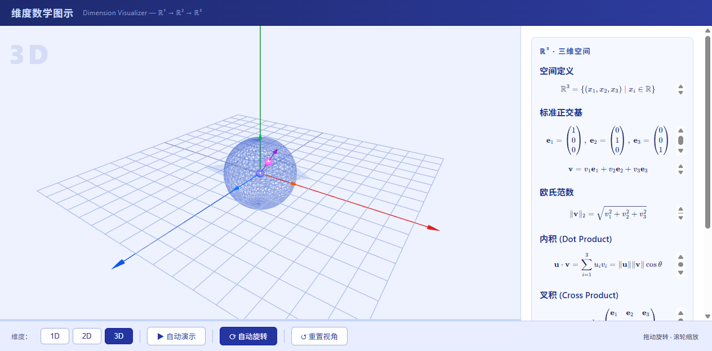

# DimViz 📐 (V002)

> **Dim**ension **Viz**ualizer — 一维到四维数学空间动态可视化（ℝ¹→ℝ²→ℝ³→ℝ⁴）

[](https://68b73c2252df4cf786cafccb8f3ba949.app.codebuddy.work/output/dimension-visualizer.html)
[](https://garywang2025.github.io/DimViz/)
[]()
[](https://github.com/GaryWang2025/DimViz)

[中文](#中文) | [English](#english)

---

## English

### ✨ Features (V002 — 4D Added!)

- 🎯 **Interactive 3D/4D Visualization** — Powered by Three.js, drag to rotate, scroll to zoom
- 🌀 **4D Tesseract (Hypercube)** — Perspective projection ℝ⁴→ℝ³, 4th dimension encoded as color gradient 🔴🔵
- 🎯 **Interactive 3D Visualization** — Powered by Three.js, drag to rotate, scroll to zoom
- 📐 **Rigorous Math Definitions** — Basis, norm, linear transformation, cross product, eigenvalues
- 🎬 **Auto Demo Mode** — Watch dimensions unfold: 1D → 2D → 3D with smooth animations
- 🔄 **Auto Rotate** — Orbits the scene automatically for better spatial intuition
- 📝 **KaTeX Formula Panel** — Real-time LaTeX rendering of mathematical definitions
- ☀️ **Light Theme** — High-contrast colors, easy on the eyes

### 🚀 Live Demo

☛ **[Try DimViz online →](https://68b73c2252df4cf786cafccb8f3ba949.app.codebuddy.work/output/dimension-visualizer.html)**

No install, no build — click and explore!

### 🚀 Quick Start

No build step required — just open in a browser:

```bash
# Clone the repo
git clone https://github.com/GaryWang2025/DimViz.git

# Open directly
open output/dimension-visualizer.html
```

Or simply download `output/dimension-visualizer.html` and double-click it.

### 📐 What's Inside

| Dimension | Visual Elements | Math Concepts |
|-----------|----------------|----------------|
| **ℝ¹** (1D) | Number line, basis arrow, sliding point | Space definition, basis, norm, linear map |
| **ℝ²** (2D) | XY grid, basis vectors, sample vector, projection dashes | Standard basis, Euclidean norm, linear transform, rotation matrix |
| **ℝ³** (3D) | 3-axis, unit sphere (wireframe), cross product plane, sample vector | Dot product, cross product, eigenvalues, unit sphere $S^2$ |
| **ℝ⁴** (4D) | Tesseract (hypercube) wireframe, w→color gradient, 6-DOF rotation | Perspective projection, 4D rotation matrices, $SO(4)$ group, color-encoded 4th dimension |

### 🛠️ Tech Stack

- [Three.js r128](https://threejs.org/) — 3D rendering
- [KaTeX](https://katex.org/) — LaTeX formula rendering
- Pure HTML/CSS/JS — zero dependencies, no build step

### 📸 Screenshots



> Open the [Live Demo](https://68b73c2252df4cf786cafccb8f3ba949.app.codebuddy.work/output/dimension-visualizer.html) to interact with it!

### 🤝 Contributing

PRs welcome! Ideas for higher dimensions (4D projections), more math concepts, or UI improvements are all appreciated.

### 📄 License

MIT © 2026

---

## 中文

### ✨ 功能特性 (V002 — 4D 新增！)

- 🎯 **可交互 3D/4D 可视化** — Three.js 驱动，拖动旋转，滚轮缩放
- 🌀 **4D 超立方体（Tesseract）** — 透视投影 ℝ⁴→ℝ³，第4维度（w）编码为颜色渐变 🔴🔵
- 📐 **严格数学定义** — 基底、范数、线性变换、叉积、特征值、4D 旋转
- 🎬 **自动演示模式** — 观看维度展开：1D → 2D → 3D，丝滑动画过渡
- 🔄 **自动旋转** — 摄像机自动环绕，建立空间直觉
- 📝 **KaTeX 公式面板** — 实时 LaTeX 渲染数学定义
- ☀️ **浅色主题** — 高对比度配色，清晰易读

### 🚀 快速开始

无需构建，浏览器直接打开：

```bash
# 克隆仓库
git clone https://github.com/GaryWang2025/DimViz.git

# 直接打开
open output/dimension-visualizer.html
```

或下载 `output/dimension-visualizer.html` 双击打开即可。

### 📐 内容概览

| 维度 | 可视化元素 | 数学概念 |
|------|-----------|---------|
| **ℝ¹**（一维）| 数轴、基向量箭头、滑动点 | 空间定义、基底、范数、线性映射 |
| **ℝ²**（二维）| XY 网格、基向量、样本向量、投影虚线 | 标准正交基、欧氏范数、线性变换、旋转矩阵 |
| **ℝ³**（三维）| 三轴、单位球（线框）、叉积平面、样本向量 | 内积、叉积、线性变换特征值、单位球面 $S^2$ |
| **ℝ⁴**（四维）| 超立方体（线框）、w→颜色渐变、6自由度旋转 | 透视投影、4D 旋转矩阵、$SO(4)$ 群、颜色编码第4维度 |

### 🛠️ 技术栈

- [Three.js r128](https://threejs.org/) — 3D 渲染引擎
- [KaTeX](https://katex.org/) — LaTeX 公式渲染
- 纯 HTML/CSS/JS — 零依赖，无需构建

### 📄 许可证

MIT © 2026

---

> Made with 🧮 and 🎨 by WorkBuddy
